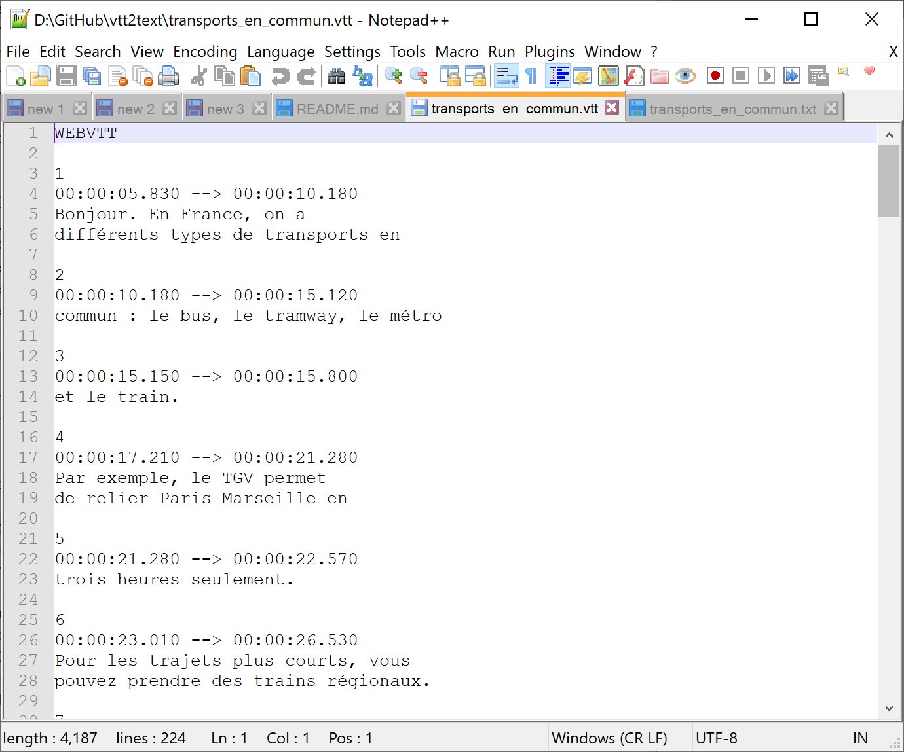
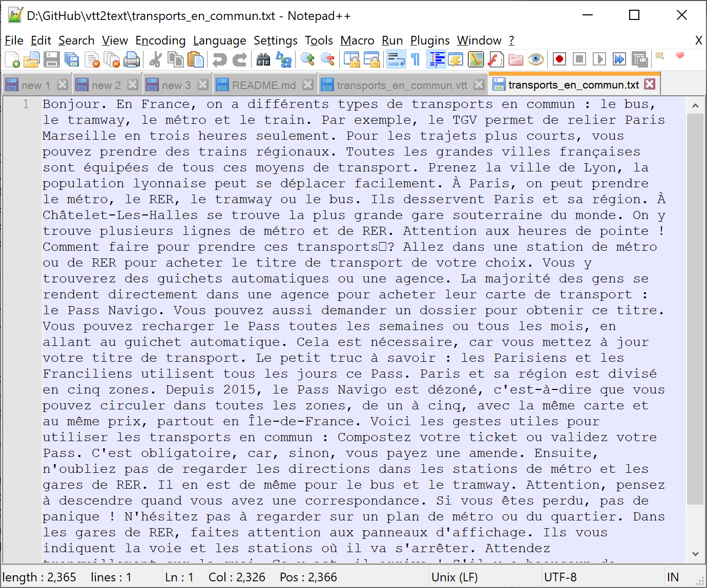

# vtt2text

Small scripts to convert a subtitle file `.vtt` to text file.

- `vtt2text.convert(filepath)`: return a clean text containing content of `vtt` file input.
- `vtt2text.tofile(filepath)`: save clean content to a text file. By default, the output file has extension `.txt` and the same name with the input file.

Before:

After:

